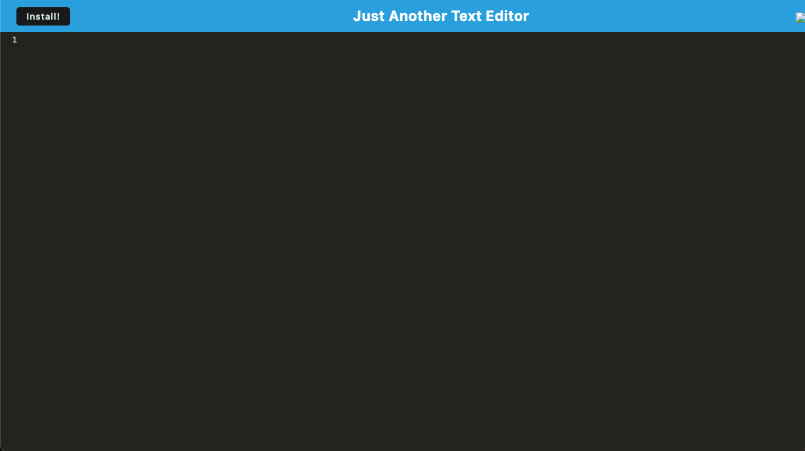

# PWA Text Editor
  

  ## Description
  
  Created a installable Text Editor Web App

  Link to Deployed App ⬇️ 
  

  ## Table of Contents
  * [Installation](#installation)
  * [Usage](#usage)
  * [License](#license)
  * [Contribute](#contribute)
  * [Testing](#testing)
  * [Questions](#questions)
  
  ## Installation
  You will need to install the following to use this project

  `webpack`, `node.js`, `babel`

  ## Usage

  The use case for this project is Lightweight Installable Text Editor

  ## License

  This Project is licensed under [MIT](https://opensource.org/licenses/MIT)

  ## Contribute

  If you would like the help contribute to this project contact GitHub Repo

  ## Testing

  To test this project do the following,

  Run Command `npm install`, `npm run start:dev`

  ## Questions
  
  For any questions related to this project contact GitHub 
  You can see more of my work on my Github [OleGreg762](https://github.com/OleGreg762)
